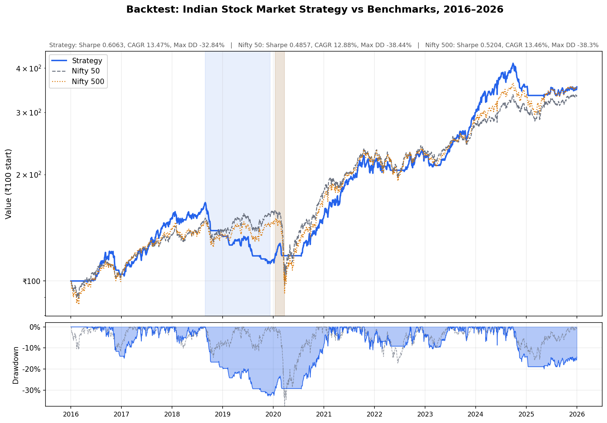
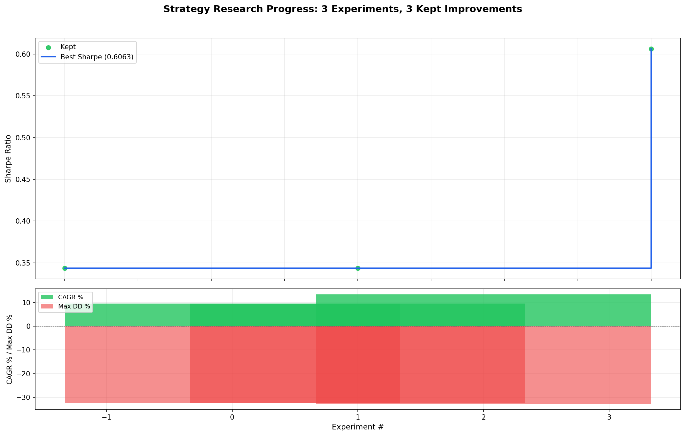

# agentic-invest


*Current best strategy vs Nifty 50 and Nifty 500, 2016–2026. Shaded regions show each curve's maximum drawdown period.*


*Experiments run autonomously by Claude. Green dots are kept improvements; the step line shows the running best Sharpe.*

_Inspired by [@greenfish8090/claude-investment-strategy](https://github.com/greenfish8090/claude-investment-strategy): instead of giving an AI agent a training loop to iterate on, give it a stock market and let it run. The agent modifies a strategy file, backtests it, checks if Sharpe improved, keeps or discards, and repeats. You wake up in the morning to a log of experiments and (hopefully) a better strategy. No tickers are hardcoded. No human intuition is encoded. Pure signal, pure iteration — for the Indian stock market._

The idea: point Claude at `program.md` and a clean backtesting harness, then step away. The agent edits only `strategy.py` — a single function that receives daily OHLCV bars for the Nifty 200 universe and returns target portfolio weights. Everything else (data fetching, order simulation, performance reporting) is fixed infrastructure the agent cannot touch.

The backtest runs **2016–2026** on the Nifty 200 universe (no survivorship bias correction — see caveats below), executes weekly at Monday open, and charges **0.1% commission per side** (typical Indian discount broker). The current best strategy achieves **Sharpe 0.61** vs. Nifty 50 at Sharpe 0.49.

---

## How it works

Three files matter:

- **`strategy.py`** — the only file the agent edits. Defines `compute_rebalance()`, which receives price history for ~180 tickers and returns a dict of `{ticker: weight}`. All signals are computed from scratch — no TA libraries. **This file is edited by the agent.**
- **`main.py`** — fixed backtest simulator. Loads cached market data, simulates weekly rebalancing with a virtual broker, and prints performance metrics. **Do not modify.**
- **`program.md`** — instructions for the agent. Defines the objective (maximize Sharpe), available signals, the experiment loop protocol, and a menu of factor ideas to explore. **This file is edited by the human.**
- **`data_fetcher.py`** — fetches Nifty 200 data via yfinance and caches to `data/` as pickle files. Runs once; all subsequent backtests are offline.
- **`plot_backtest.py`** — generates the equity curve chart and experiment progress scatter.

## Results

| Metric | Strategy | Nifty 50 | Nifty 500 |
|---|---|---|---|
| Sharpe Ratio | **0.61** | 0.49 | 0.52 |
| CAGR | **13.5%** | 12.9% | 13.5% |
| Max Drawdown | **-32.8%** | -38.4% | -38.3% |
| Annual Volatility | **13.1%** | 16.2% | 16.0% |
| Sortino Ratio | **0.74** | 0.59 | — |

Backtest period: January 2016 – January 2026. Universe: ~187 Nifty 200 stocks. Initial capital: ₹1 crore.

## Data source

All data is fetched via **[yfinance](https://github.com/ranaroussi/yfinance)** using NSE ticker symbols (e.g. `RELIANCE.NS`). No API key required.

- **Price data (OHLCV):** Daily adjusted closes for ~200 Nifty 200 stocks, 2014–2026
- **Benchmark:** Nifty 50 (`^NSEI`), Nifty 500 (`^CRSLDX`)
- **India VIX:** `^INDIAVIX` (volatility regime detection)
- **Sector data:** Yahoo Finance sector/industry classification per ticker

Data is fetched once on the first run and cached to `data/price_data.pkl`, `data/benchmark_data.pkl`, `data/sector_data.pkl`. All subsequent runs use the local cache.

## Quick start

**Requirements:** [conda](https://docs.conda.io/en/latest/), Python 3.11+

```bash
# 1. Create environment and install dependencies
conda create -n invest python=3.11 -y
conda activate invest
pip install yfinance matplotlib pandas numpy requests tqdm

# 2. Fetch market data and run the baseline backtest
#    First run downloads all data (~2-3 min) and caches it locally
python main.py

# 3. Plot results
python plot_backtest.py
```

After step 2, all future runs use the local cache — no network needed.

## Running the agent

Open Claude Code in this directory, then start with:

```
Hi, have a look at program.md and let's kick off a session!
```

The agent will read the current best Sharpe from `results.tsv`, propose a hypothesis, edit `strategy.py`, run the backtest, and log the result. It keeps iterating — modifying strategy logic, running the backtest, reverting failed experiments — until you interrupt it.

You can also point an autonomous agent at it:

```bash
# Activate the environment first
eval "$(conda shell.bash hook)" && conda activate invest

# Run a single backtest and log result
python main.py --description "experiment: your hypothesis here"

# Output metrics as JSON (useful for automated evaluation)
python main.py --json
```

## Strategy

The current strategy is a **quality-momentum multi-factor approach** for the Indian market:

**Universe filtering**
- Only stocks with 12+ months of price history (need sufficient lookback)
- Only stocks with positive momentum (trend-following, not contrarian)
- Only stocks outperforming Nifty 50 over 6 months (relative strength filter)

**Signals**
- **12m-1m momentum** (40% weight): 12-month return with 1-month skip to avoid short-term reversal — the strongest documented factor in Indian equities
- **6m-1m momentum** (included in composite): 6-month return with 1-month skip
- **3m-2w momentum** (included in composite): 3-month return with 2-week skip
- **Inverse volatility** (25% weight): lower realized volatility = better quality proxy
- **Relative strength vs Nifty 50** (20% weight): must be outperforming the benchmark
- **Volume confirmation** (15% weight): rising volume relative to 60-day average

**Risk management**
- Nifty 50 trend filter: go to cash when Nifty 50 is below its 200-day MA (bear market protection)
- VIX-based position sizing: 5–20 positions depending on India VIX level
- 20% trailing stop from entry peak
- Sector cap: no more than 30% in any single sector
- Individual position cap: 10% of portfolio

**Portfolio construction**
- Inverse-volatility weighting (risk parity)
- Monthly rebalancing cadence (avoids excessive churn from weekly execution)
- No leverage (max total weight = 1.0)

## Project structure

```
strategy.py           — portfolio logic (agent edits this)
main.py               — backtest simulator (do not modify)
data_fetcher.py       — market data loader and cache manager
plot_backtest.py      — equity curve and progress visualization
program.md            — agent instructions
data/
  price_data.pkl      — cached OHLCV for ~200 Nifty 200 stocks
  benchmark_data.pkl  — Nifty 50, Nifty 500, India VIX
  sector_data.pkl     — sector/industry classification
results.tsv           — experiment log
backtest_equity.png   — equity curve chart
progress.png          — experiment progress chart
```

## Design choices

- **Single function to modify.** The agent only touches `compute_rebalance()` in `strategy.py`. This keeps diffs small, prevents overfitting the infrastructure, and keeps results interpretable.
- **No lookahead by construction.** The strategy receives T-1 close data. There is no way to accidentally use future prices.
- **Weekly execution, monthly decisions.** The backtesting engine calls `compute_rebalance()` every Monday, but the strategy internally rebalances monthly to reduce transaction costs.
- **Fixed infrastructure.** `main.py` handles data, execution, and reporting. The agent cannot game the simulator because it cannot edit it.
- **Sharpe as the primary metric.** Return alone is easy to maximize with leverage or concentration. Sharpe forces the agent to find strategies with genuine risk-adjusted edge.
- **Readable code.** The goal is a strategy you can actually understand — not a black box. Every decision in `strategy.py` is a readable signal or weighted rank. You can look at it and say "this is why it bought HDFC Bank in 2023" — because 6-month momentum ranked in the top quartile and volatility was below the sector median.

## Caveats

- **Survivorship bias.** The Nifty 200 universe uses current constituents. Stocks that were delisted, merged, or removed over 2016–2026 are not included if they aren't in the index today. This inflates performance, particularly for the universe filter. A production system should use point-in-time index membership data (available from NSE but requires manual assembly).
- **Transaction costs.** 0.1% per side covers brokerage but not STT (0.1% on equity delivery sells), exchange fees, or GST. Real-world costs are modestly higher — reduce the CAGR by ~0.3–0.5% per year.
- **Market impact.** The strategy holds 10–20 positions across mid-cap stocks. Actual execution at 1 crore is feasible; at larger sizes, mid-cap liquidity becomes a constraint.
- **10-year window.** 2016–2026 was a broadly bullish period for Indian equities. The strategy has not been stress-tested against the 2008 financial crisis or the 2000 dot-com crash.

## Why not just train an ML model?

The standard alternative is to frame portfolio selection as a supervised or reinforcement learning problem. This has a fundamental problem: **you cannot read what it learned.** When the model underperforms, you cannot tell whether it found a genuine signal or overfit to a decade of IT and banking outperformance.

The strategy produced here is ~150 lines of plain Python. Every decision is a readable weighted rank or conditional. You can audit it, reason about it, and improve it deliberately. That interpretability matters when deciding whether to trust a strategy with real capital — and it matters for the agent too, since it can reason about its own code in a way it cannot reason about neural network weights.

## Further work

- **Point-in-time index membership.** The most important improvement — eliminate survivorship bias by using NSE's historical index composition data.
- **Fundamental data.** yfinance provides P/E, ROE, and EPS via `.info` but coverage is inconsistent. [Screener.in](https://www.screener.in) offers 10+ years of cleaned fundamentals for Indian companies and would enable quality factors that go beyond volatility proxies.
- **Longer backtest.** Extending to 2010–2026 (or further) would include the 2011 correction and 2015–2016 mid-cap selloff, providing a more rigorous stress test.
- **Broader universe.** Nifty 500 adds ~300 mid- and small-cap stocks where momentum effects are stronger. Requires more careful liquidity filtering.
- **Transaction cost modeling.** Add STT, exchange fees, and SEBI charges for more accurate P&L.

## License

MIT
